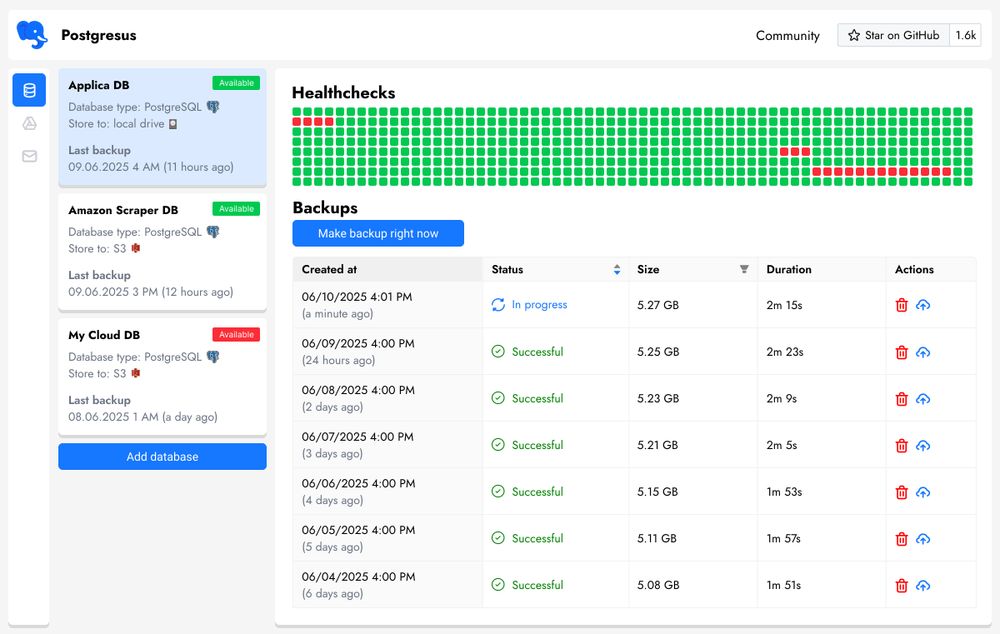

<div align="center">
  

  <h3>PostgreSQL monitoring and backup</h3>
  <p>Free, open source and self-hosted solution for automated PostgreSQL monitoring and backups. With multiple storage options and notifications</p>
  
  <!-- Badges -->
  [](LICENSE)
  [](https://hub.docker.com/r/rostislavdugin/postgresus)
  [](https://github.com/RostislavDugin/postgresus)
  
  [](https://www.postgresql.org/)
  [](https://github.com/RostislavDugin/postgresus)
  [](https://github.com/RostislavDugin/postgresus)
  
  <p>
    <a href="#-features">Features</a> •
    <a href="#-installation">Installation</a> •
    <a href="#-usage">Usage</a> •
    <a href="#-license">License</a> •
    <a href="#-contributing">Contributing</a>
  </p>

  <p style="margin-top: 20px; margin-bottom: 20px; font-size: 1.2em;">
    <a href="https://postgresus.com" target="_blank"><strong>🌐 Postgresus website</strong></a>
  </p>
  
  
  
 
</div>

---

## ✨ Features

### 🔄 **Scheduled Backups**

- **Flexible scheduling**: hourly, daily, weekly, monthly
- **Precise timing**: run backups at specific times (e.g., 4 AM during low traffic)
- **Smart compression**: 4-8x space savings with balanced compression (~20% overhead)

### 🗄️ **Multiple Storage Destinations**

- **Local storage**: Keep backups on your VPS/server
- **Cloud storage**: S3, Cloudflare R2, Google Drive, NAS, Dropbox and more
- **Secure**: All data stays under your control

### 📱 **Smart Notifications**

- **Multiple channels**: Email, Telegram, Slack, Discord, webhooks
- **Real-time updates**: Success and failure notifications
- **Team integration**: Perfect for DevOps workflows

### 🐘 **PostgreSQL Support**

- **Multiple versions**: PostgreSQL 13, 14, 15, 16 and 17
- **SSL support**: Secure connections available
- **Easy restoration**: One-click restore from any backup

### 🐳 **Self-Hosted & Secure**

- **Docker-based**: Easy deployment and management
- **Privacy-first**: All your data stays on your infrastructure
- **Open source**: MIT licensed, inspect every line of code

### 📊 **Monitoring & Insights**

- **Real-time metrics**: Track database health
- **Historical data**: View trends and patterns over time
- **Alert system**: Get notified when issues are detected

### 📦 Installation

You have three ways to install Postgresus:

- Script (recommended)
- Simple Docker run
- Docker Compose setup


---

## 📦 Installation

You have three ways to install Postgresus: automated script (recommended), simple Docker run, or Docker Compose setup.

### Option 1: Automated Installation Script (Recommended, Linux only)

The installation script will:

- ✅ Install Docker with Docker Compose(if not already installed)
- ✅ Set up Postgresus
- ✅ Configure automatic startup on system reboot

```bash
sudo apt-get install -y curl && \
sudo curl -sSL https://raw.githubusercontent.com/RostislavDugin/postgresus/refs/heads/main/install-postgresus.sh \
| sudo bash
```

### Option 2: Simple Docker Run

The easiest way to run Postgresus with embedded PostgreSQL:

```bash
docker run -d \
  --name postgresus \
  -p 4005:4005 \
  -v ./postgresus-data:/postgresus-data \
  --restart unless-stopped \
  rostislavdugin/postgresus:latest
```

This single command will:

- ✅ Start Postgresus
- ✅ Store all data in `./postgresus-data` directory
- ✅ Automatically restart on system reboot

### Option 3: Docker Compose Setup

Create a `docker-compose.yml` file with the following configuration:

```yaml
version: "3"

services:
  postgresus:
    container_name: postgresus
    image: rostislavdugin/postgresus:latest
    ports:
      - "4005:4005"
    volumes:
      - ./postgresus-data:/postgresus-data
    restart: unless-stopped
```

Then run:

```bash
docker compose up -d
```

---

## 🚀 Usage

1. **Access the dashboard**: Navigate to `http://localhost:4005`
2. **Add first DB for backup**: Click "New Database" and follow the setup wizard
3. **Configure schedule**: Choose from hourly, daily, weekly or monthly intervals
4. **Set database connection**: Enter your PostgreSQL credentials and connection details
5. **Choose storage**: Select where to store your backups (local, S3, Google Drive, etc.)
6. **Add notifications** (optional): Configure email, Telegram, Slack, or webhook notifications
7. **Save and start**: Postgresus will validate settings and begin the backup schedule

### 🔑 Resetting Admin Password

If you need to reset the admin password, you can use the built-in password reset command:

```bash
docker exec -it postgresus ./main --new-password="YourNewSecurePassword123"
```

---

## 📝 License

This project is licensed under the MIT License - see the [LICENSE](LICENSE) file for details.

---

## 🤝 Contributing

Contributions are welcome! Read [contributing guide](contribute/readme.md) for more details, prioerities and rules are specified there. If you want to contribute, but don't know what and how - message me on Telegram [@rostislav_dugin](https://t.me/rostislav_dugin)
