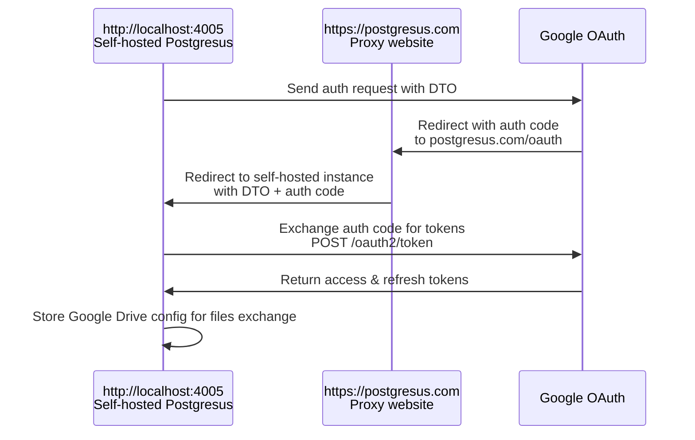

Cloud storages usually require OAuth (Google Drive, Dropbox, OneDrive)

OAuth services usually need HTTPS domain for authorization. Self hosted Postgresus can be hosted via HTTP or even without static IP so this way does not work. To make OAuth works even on localhost, we proxy requests via postgresus.com domain

As permanent URL for authorization we use main Postgresus domain. It forward responses to the self hosted domain so it can get access to the cloud

This is the sequence of requests (example for Google Drive):

